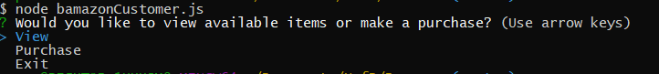
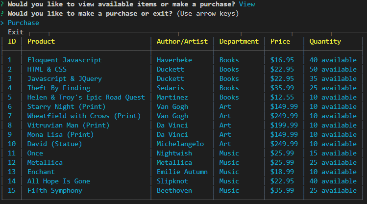
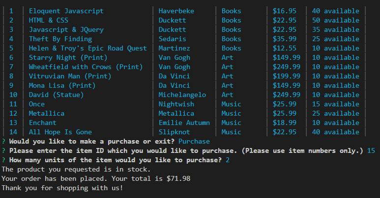
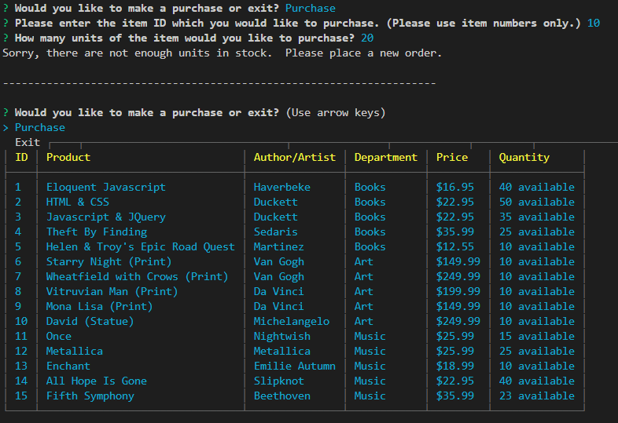

# Bamazon

## Introduction ##
Bamazon is a CLI application that allows users to participate in a storefront experience (like Amazon).  It utilizes MySQL and Node to take in user input, as well as and query and update a database.
### Before Running Application ###
You will need to install the `inquirer` and `pixl-cli` packages.  The password necessary for opening and running the `.sql` file in MySQL is in the `bamazonCustomer.js` file.
## Customer View ##
The customer view offers customers the ability to view and purchase products, updates the inventory accordingly, and displays the total cost of the customer's purchase.
  
This is the entry menu the customer sees on opening the program.
  

  
This shows the view of all products when the customer selects "view".  Once "view" has been selected, users are then given the option to make a purchase or exit the program.
  

  
This shows what happens when the customer selects "purchase".  The customer is prompted to choose the item number of the product they want to purchase, and then the quantity of that product.  If there is enough product in stock, they are told their purchase has been a success, and are given the total cost of their purchase.  The quantity is then updated in the stock database.
  

  
This last view is what happens when a user attempts to purchase a product that is no longer in stock, or when they attempt to purchase more items than are available.  They are given the option to return to the main menu to either make a purchase or exit.
  

## Manager View ##
